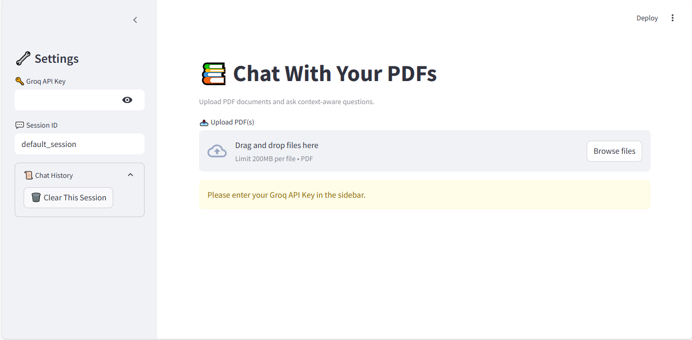

# 🧠 Conversational RAG PDF Chatbot

This is a Conversational Retrieval-Augmented Generation (RAG) application built using **Streamlit**, **LangChain**, **Groq**, and **Chroma vectorstore**, that allows users to **upload PDF files and ask questions directly from their content**. The app uses **chat history awareness** and HuggingFace embeddings to retrieve relevant context and generate answers. If the question is unrelated to the uploaded PDFs, the assistant politely declines.

---

## 🚀 Features

- 📄 **Upload one or multiple PDF files**
- 🤖 **Ask natural-language questions about their content**
- 📚 **Retrieval-augmented generation (RAG) pipeline**
- 💬 **Chat history memory by session**
- ✅ **Strict answer generation only from PDF content**
- 🧠 Powered by **Groq's ultra-fast LLMs** (Gemma, Mixtral, etc.)
- 🔍 **Embeddings via HuggingFace**
- 🗂️ **Sidebar-based session and chat history**

---

## 🖥️ Demo

> ⚠️ You must have a valid [Groq API key](https://console.groq.com/) and HuggingFace token.

 <!-- optional, add your screenshot -->

---

## 🔧 Tech Stack

- [Streamlit](https://streamlit.io/)
- [LangChain](https://www.langchain.com/)
- [Groq API](https://console.groq.com/)
- [ChromaDB](https://www.trychroma.com/)
- [HuggingFace Embeddings](https://huggingface.co/)
- [PDF Loader](https://python.langchain.com/docs/modules/data_connection/document_loaders/pdf)

---

## 🛠️ Installation
```bash
git clone https://github.com/rizwanchanna/RAG-PDF-Chatbot
cd RAG-PDF-Chatbot
```

# Create virtual environment (optional)
```bash
python -m venv venv
source venv/bin/activate  # On Windows: venv\Scripts\activate
```

# Install dependencies
```bash
pip install -r requirements.txt
```
## 🔑 Environment Variables
Create a .env file in the root folder:
HF_TOKEN="your_huggingface_token" in string

## 🗝️ How to Run
```bash
streamlit run streamapp.py
```

## 🧪 Usage
Enter your Groq API key in the sidebar.

Upload one or more PDF files.

Ask questions like:

"What is the main topic of this paper?"

"Explain the results in section 3."

If the question isn't related to your PDF, the assistant will say:

"I don't know the answer of this question. Ask me about your PDF file only."

## Project Stucture
```bash
.
├── app.py               # Main Streamlit app
├── requirements.txt     # Python dependencies
├── .env                 # HuggingFace token
└── README.md
```
